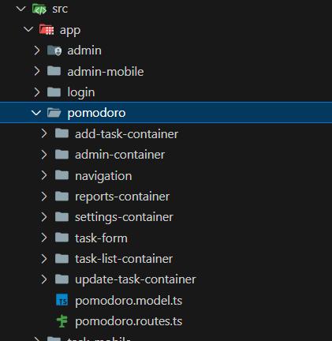

##  📝 Descripción
Esta aplicación fue desarrollada utilizando Angular 18 y Material Design 3 para ofrecer una interfaz moderna y accesible. Empleamos Capacitor para generar la aplicación móvil.

Aunque ambas versiones comparten la base tecnológica, las funcionalidades están separadas según el tipo de usuario y el enfoque de cada plataforma:

- **Aplicación web**: Orientada a la **administración** de tareas. Permite a los usuarios registrar cuentas, gestionar tareas (crear, editar, eliminar), generar reportes mensuales y realizar configuraciones de la aplicación.
  
- **Aplicación móvil**: Diseñada para que los **usuarios finales** puedan gestionar y realizar sus tareas diarias utilizando la técnica Pomodoro. Incluye funcionalidades como iniciar tareas, gestionar descansos y visualizar listas de tareas diarias.

A continuación, se describe la estructura del proyecto y los pasos detallados para su ejecución en cada plataforma.

##  🗂️ Estructura de Archivos

El proyecto está organizado en dos versiones, una para la web y otra para dispositivos móviles, manteniendo separadas las funcionalidades específicas de cada una:

- **pomodoro**: Contiene las funcionalidades de la aplicación web, enfocada en la administración de tareas. Esto incluye la creación, edición, eliminación de tareas, generación de reportes mensuales y configuración de la aplicación.

    

- **task-mobile**: Contiene las funcionalidades de la aplicación móvil, diseñada para que los usuarios gestionen y realicen sus tareas diarias utilizando la técnica Pomodoro. Las principales funcionalidades móviles incluyen iniciar tareas, gestionar descansos y visualizar listas de tareas diarias.

    

### Módulos principales:

- `pomodoro.routes.ts`: Define las rutas específicas para la versión web, permitiendo a los usuarios gestionar sus tareas y generar reportes.
- `task-mobile.routes.ts`: Define las rutas específicas para la versión móvil, permitiendo a los usuarios finales ejecutar y gestionar sus tareas diarias.

### Gestión de rutas por plataforma:

El archivo encargado de gestionar las rutas según la plataforma es `app.routes.ts`, ubicado en la ruta [src/app/app.routes.ts](./src/app/app.routes.ts). Este archivo contiene la lógica que determina la carga de las rutas dependiendo del tipo de plataforma en la que se ejecuta la aplicación. Si la aplicación detecta que está corriendo en una plataforma nativa, carga las rutas de `task-mobile`. En caso contrario, carga las rutas de la versión web (`pomodoro`).

A continuación, un extracto del código:

```typescript
import { Routes } from '@angular/router';
import { Capacitor } from '@capacitor/core';

const childrenDesktop = () =>
  import('./pomodoro/pomodoro.routes').then((routes) => routes.PomodoroRoutes);

const childrenMobile = () =>
  import('./task-mobile/task-mobile.routes').then((routes) => routes.TaskMobileRoutes);

const children = Capacitor.isNativePlatform() ? childrenMobile : childrenDesktop;

export const routes: Routes = [
  {
    path: '',
    loadChildren: children,
  },
];
```

## 💻  Ejecución Web App

### Prerrequisitos

Antes de ejecutar la aplicación web, asegúrate de tener instalados los siguientes componentes:

- **Node.js** v20.11.0: Es necesario para poder ejecutar y compilar el proyecto. Si no tienes Node.js instalado, puedes descargarlo desde la [página oficial de Node.js](https://nodejs.org/).
- **Angular CLI** v18: Angular CLI es la herramienta que utilizamos para desarrollar, compilar y desplegar la aplicación. 

Si ya tienes Node.js instalado, puedes instalar Angular CLI versión 18 globalmente con el siguiente comando:

```bash
npm install -g @angular/cli@18
```

### Pasos para ejecutar la aplicación

Sigue los siguientes pasos para ejecutar la aplicación web localmente:

1. Abre una terminal y navega hasta la carpeta raíz del proyecto.
2. Ejecuta el siguiente comando para instalar todas las dependencias necesarias:

   ```bash
   npm i
   ```

3. Una vez que todas las dependencias estén instaladas, ejecuta el siguiente comando para iniciar el servidor de desarrollo:

   ```bash
   ng serve
   ```

4. La aplicación estará disponible en el navegador en la dirección predeterminada: `http://localhost:4200`.

[Video ejecución Webapp](https://drive.google.com/file/d/1cl0oXYmFshnwpeVA2-58UNBy2pKenvb_/view?usp=sharing)


##  📱 Ejecución Mobile App

### Prerrequisitos

Antes de ejecutar la aplicación móvil, asegúrate de tener lo siguiente:

- **Android Studio**: Es necesario para compilar y ejecutar la aplicación en dispositivos Android o emuladores, [página oficial android studio](https://developer.android.com/studio?hl=es-419#get-android-studio).
- **Dispositivo con API de Android 35 o superior**: La aplicación requiere que el dispositivo o emulador utilice la API de Android 35 o superior.

### Pasos para ejecutar la aplicación móvil

1. Abre una terminal y navega hasta la carpeta raíz del proyecto.
2. Ejecuta el siguiente comando para compilar el proyecto:

   ```bash
   ng build
   ```

3. Luego, sincroniza el proyecto con Capacitor ejecutando el siguiente comando:

   ```bash
   npx cap sync
   ```

4. Después de sincronizar, abre el proyecto en Android Studio con el siguiente comando:

   ```bash
   npx cap open android
   ```

5. Una vez que Android Studio esté abierto, puedes compilar y ejecutar la aplicación en un emulador o dispositivo físico que tenga **API 35 o superior**.

[Video ejecucion App mobile](https://drive.google.com/file/d/1GydTZwkZvGHdOZQRTaGpjqTM2Kt_TyOa/view?usp=sharing)

## 📦 APK Aplicación

- [Descargar apk](./apk/focusapp.apk)

- [Video FocusApp en dispositivo android tema oscuro](https://drive.google.com/file/d/1kTk54--J2zPJyqyJqVZ-y_SCgOHmmHsc/view?usp=sharing)
